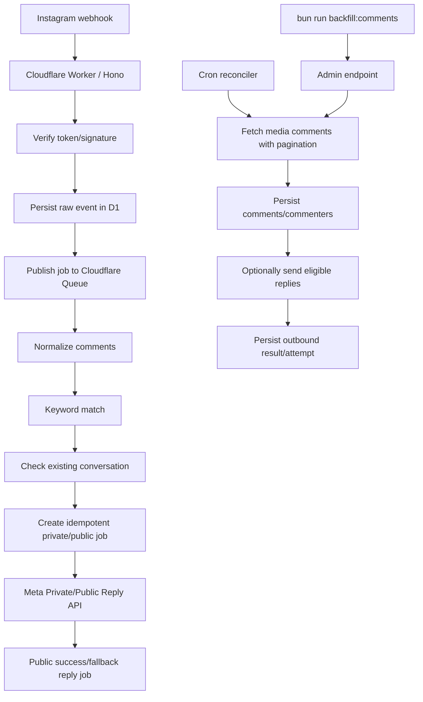

# Instagram Bot

TypeScript-бот для автоматизации ответов на комментарии в Instagram через официальный Meta/Instagram API.

## Короткое решение

MVP делаем на официальном Instagram API от Meta, без `instagram-private-api`, браузерной автоматизации, cookie/session automation и эмуляции мобильного клиента.

Основной сценарий: пользователь пишет под постом/Reels или во входящем Direct одно из заданных ключевых слов. Для комментария бот проверяет, что с этим человеком ещё нет открытого conversation, и только после этого отправляет public reply и/или private reply через официальный `comment_id`. Для входящего Direct бот отправляет только `private`-текст matched rule обратно в тот же диалог.

Аккаунт может быть Creator: Instagram API работает с Instagram professional accounts, то есть Business и Creator. Для MVP используем Instagram API with Instagram Login через `graph.instagram.com` и permissions `instagram_business_basic` / `instagram_business_manage_comments` / `instagram_business_manage_messages`.

Ответы на входящие Direct включаются флагом `DM_AUTOREPLY_ENABLED=true`. Это не холодная рассылка: бот отвечает только на inbound text DM, который Meta прислала через webhook.

Рекомендуемая платформа: Cloudflare Workers + Hono + D1 + Queues + Cron Triggers. Bun остаётся локальным рантаймом, package manager и CLI-слоем для ручных команд.

## Что должен делать бот

1. Принимать новые комментарии под постами, Reels и другими поддерживаемыми media через webhook.
2. Принимать inbound text Direct через webhook.
3. Если комментарий содержит ключевое слово и с автором нет существующего conversation, отправлять public/private reply через официальный Meta API.
4. Если входящий Direct содержит ключевое слово, отправлять private-текст matched rule через официальный Send API с `recipient.id`.
5. По старым видео запускать ручной backfill через `bun run backfill:comments -- --media <mediaId>`.
6. В backfill-режиме создавать reply jobs только для keyword-комментариев, которые ещё попадают в 7-дневное окно Meta, только при `--send` + `BACKFILL_REPLY_ENABLED=true` и только если conversation ещё не существует.
7. Для старых комментариев вне 7-дневного окна только сохранять данные без automatic replies.
8. Сохранять события, комментарии, Direct-сообщения, ответы, ошибки, attempts, dedupe-ключи и статус обработки.
9. Не отправлять повторный ответ на один и тот же `comment_id` или `message.mid`.
10. Давать `bun run` команды для просмотра статуса и ручного backfill.

## Важные ограничения Meta API

### DM и папка General

Формулировка "ловить все сообщения из папки General" конфликтует с тем, как API видит Instagram Inbox. API/webhooks не дают надёжного product-level фильтра "обрабатывать только входящие сообщения, которые уже лежат в General".

Решение MVP: для DM обрабатываются только inbound text events, которые Meta отдаёт через webhook. Фильтра по папке General нет; dedupe делается по `message.mid`, а состояние диалога хранится в нашей базе только для matched keyword-сообщений.

### Кому можно отправлять DM

Официальный Send API не предназначен для холодной рассылки по произвольным Instagram-аккаунтам. Private reply на свежий комментарий — отдельный разрешённый сценарий: отправка идёт не по username, а по `comment_id`, который пришёл из webhook или был получен через comments API. Direct auto-reply отправляется только после того, как пользователь сам написал аккаунту, по Instagram-scoped sender ID из inbound webhook.

Private reply ограничения:

- один private reply на один комментарий;
- private reply должен быть отправлен в течение 7 дней после комментария;
- follow-up сообщения возможны только если пользователь ответил, и дальше действуют messaging-window ограничения.

Следствие для старых видео: мы можем собрать список комментаторов и комментариев, но automatic DM/private reply по комментариям старше 7 дней официальным API не поддерживается.

## MVP Scope

### Входит

- Cloudflare Worker с Hono:
  - `GET /health`;
  - `GET /webhooks/instagram` для верификации webhook;
  - `POST /webhooks/instagram` для signed intake;
  - `GET /admin/status` для `bun run bot:status`;
  - `POST /admin/backfill/media/:mediaId` для `bun run backfill:comments`;
  - `GET /admin/data-subject` и `POST /admin/data-subject/redact` для внутреннего dry-run/anonymize workflow.
- Проверка `X-Hub-Signature-256` через `META_APP_SECRET`.
- D1-хранилище:
  - `webhook_events`;
  - `webhook_event_subjects`;
  - `instagram_accounts`;
  - `comments`;
  - `direct_messages`;
  - `comment_processing_decisions`;
  - `reply_jobs`;
  - `reply_attempts`;
  - `reply_rate_limit_slots`;
  - `media_backfill_runs`;
  - `media_commenters`;
  - `settings`.
- Queue consumer для обработки webhook events вне intake path.
- Keyword matching v1:
  - без учёта регистра;
  - нормализация пробелов;
  - substring-вхождение по словам/коротким фразам из `config/reply-rules.json`;
  - один общий набор reply rules для realtime и backfill.
- Private/public reply по комментарию, если комментарий содержит ключевое слово, не от самого подключённого Instagram account, не имеет существующего conversation и eligible по 7-дневному окну.
- Direct reply на inbound text DM, если сообщение содержит ключевое слово из тех же правил `config/reply-rules.json`; используется только `private`-текст matched rule.
- Проверка существующего conversation делается через Conversations API по Instagram-scoped commenter ID; если conversation уже есть, новый auto reply не создаётся, а transient lookup failure оставляет eligible reply jobs в retryable backlog.
- Public reply по тому же comment включается через `COMMENT_PUBLIC_REPLY_ENABLED=true`.
- `live_comments` в MVP только сохраняются как `comment_kind=live`; private replies для них не создаются, потому что Live private replies требуют отдельной проверки активного эфира.
- Retry policy, атомарный rate-limit guard через D1 slots, сохранение Meta errors/fbtrace.
- Cron maintenance: ежеминутный sender due jobs, cleanup expired raw webhook payloads и token health check раз в 10 минут.
- Cron reconciler раз в 10 минут подтягивает свежие комментарии через Graph API за последние 24 часа, чтобы восстановить события, которые не пришли через webhook.
- Internal data subject tooling: `bun run data:redact` по умолчанию показывает dry-run отчёт, а `--apply` анонимизирует найденные данные.

### Не входит

- Холодная рассылка старым комментаторам.
- Private replies для комментариев старше 7 дней.
- Automatic replies для комментариев старше 7 дней.
- Управление Instagram через браузер, мобильный private API или cookie-сессию.
- React-админка.
- AI-ответы и генерация текста через LLM.
- CI/CD через GitHub Actions.

## Архитектура обработки



## Основные контракты

### Webhook intake

- Verification отвечает `hub.challenge` только если `hub.verify_token` совпадает с `META_WEBHOOK_VERIFY_TOKEN`.
- POST webhook читает raw body до JSON parsing, чтобы проверить `X-Hub-Signature-256`.
- После успешной проверки payload сохраняется в D1 и ставится в Queue.
- Queue binding обязателен: если событие нельзя поставить в очередь, endpoint возвращает `500`, чтобы Meta повторила доставку.
- Повторная доставка того же события не создаёт повторный reply job.
- Cron maintenance переотправляет stale webhook events из `received`/`processing`/`failed` обратно в Queue, если они старше 10 минут и ещё не исчерпали 3 попытки.

### Comment reply

- На новый comment webhook создаются reply jobs, если комментарий не от владельца аккаунта, не был обработан ранее, содержит ключевое слово, попадает в 7-дневное окно и проходит conversation gate для matched rule.
- Keywords и тексты ответов описываются в `config/reply-rules.json`.
- Формат правила: `{"keywords":["ключ1","ключ2"],"public":"публичный ответ","private":"личный ответ","always":true}`.
- `keywords` также может быть строкой с comma-separated списком: `"ключ1,ключ2"`.
- По умолчанию `always` выключен: если с автором уже есть conversation, auto reply не создаётся.
- `always: true` пропускает existing-conversation gate для этого keyword rule и отправляет public/private replies даже существующим диалогам.
- Если `COMMENT_PUBLIC_REPLY_ENABLED=true` и у matched rule есть `public`, создаётся public-reply job с этим текстом.
- Если `COMMENT_PRIVATE_REPLY_ENABLED=true` и у matched rule есть `private`, создаётся private-reply job с этим текстом.
- `public` уходит публичным ответом в ветку комментария через `/{comment_id}/replies`.
- `private` уходит личным private reply по комментарию через `/{instagram_account_id}/messages` с `recipient.comment_id`.
- `DM_AUTOREPLY_ENABLED` относится только к автоответам на входящие Direct и не включает private reply по комментарию.
- Для полного pause production отправки держать `BOT_ENABLED=false`, `COMMENT_PUBLIC_REPLY_ENABLED=false`, `COMMENT_PRIVATE_REPLY_ENABLED=false`, `DM_AUTOREPLY_ENABLED=false` и `BACKFILL_REPLY_ENABLED=false`.
- Перед созданием jobs и перед фактической отправкой повторно проверяется, что conversation с автором комментария ещё не существует, если matched rule не помечен `always: true`.
- Если Conversations API временно недоступен на intake, eligible jobs создаются как `retryable` с `conversation_lookup_failed`; перед отправкой lookup выполняется заново.
- Перед отправкой проверяется лимит "один private reply на комментарий".
- Если у правила есть private и public тексты, сначала создаётся и отправляется private reply job. Public success reply создаётся только после успешного private reply или Meta-ответа "already replied".
- Если Meta возвращает private reply ошибку `code=100/subcode=2534025`, job сначала retryable по обычной retry policy; ручная проверка показала, что Meta часто начинает принимать тот же `comment_id` спустя 1-5 минут. После исчерпания попыток job блокируется как `private_reply_invalid`, а бот создаёт public fallback reply: "не получилось 🤷‍♀️, ошибка в инсте какая-то. попробуйте ещё раз?)".
- Public reply jobs retryable на ambiguous network/408/5xx failures; возможный дубль публичного комментария на таких ошибках допустим.
- Terminal Meta 400 для недоступного comment/user блокируют job как expected terminal condition (`meta_object_unavailable` / `meta_recipient_unavailable`), а не держат его в `failed`; cron maintenance также нормализует уже накопленные terminal `failed` jobs.
- Старые `failed` private jobs с `code=100/subcode=2534025` миграция переводит в `blocked/private_reply_invalid` без retroactive fallback.
- `BOT_ENABLED=false` или `token_invalid` временно ставят отправку на retry-pause.
- Disabled reply flags блокируют jobs выключенного типа, чтобы старый private backlog не задерживал включённые public replies.
- Ручная команда `bun run reply:comment -- --comment <commentId>` проходит те же safety gates, что automatic replies; HTTP `?force=1` допускается только как operator bypass для keyword и `BOT_ENABLED`, но не для own/live/stale/missing-commenter/existing-conversation ограничений.

### Direct reply

- На inbound text DM webhook бот ищет keyword тем же matcher и теми же правилами `config/reply-rules.json`.
- Если matched rule содержит `private`, создаётся `direct_message_reply` job с idempotency key `direct_message_reply:{message.mid}`.
- Direct reply отправляется через `/{instagram_account_id}/messages` с `recipient.id = sender.id`.
- Для Direct не создаётся `public` reply, не применяется `always`, не проверяется 7-дневное comment private-reply окно и не выполняется existing-conversation gate: сам inbound DM уже является пользовательским началом диалога.
- `DM_AUTOREPLY_ENABLED=false` не создаёт новые Direct reply jobs и cron maintenance блокирует старый pending/retryable Direct backlog как `reply_type_disabled`.

### Backfill

- Backfill запускается вручную:
  - `bun run backfill:comments -- --media <mediaId>`;
  - `bun run backfill:comments -- --media <mediaId> --send`.
- Account-wide проход по media запускается вручную:
  - `bun run backfill:account-comments`;
  - `bun run backfill:account-comments -- --send --max-media-pages 1 --max-comment-pages 25`.
- Команда вызывает authenticated admin endpoint через `ADMIN_API_KEY`.
- Worker читает комментарии страницами через `/comments`.
- Результат сохраняется в `comments` и `media_commenters`.
- Backfill keywords берутся из тех же правил в `config/reply-rules.json`.
- `--send` создаёт reply jobs только для comments с keyword, которые ещё попадают в 7-дневное окно, и только если `BACKFILL_REPLY_ENABLED=true`.
- Backfill не отправляет Meta replies внутри admin request: отправку выполняет ежеминутный scheduled sender.
- Backfill не отправляет холодные DM: перед созданием job и перед отправкой проверяется существующий conversation, а комментарии старше 7 дней только сохраняются.
- Один запуск обрабатывает не больше `BACKFILL_MAX_PAGES_PER_RUN` страниц, возвращает `nextCursor`, и при необходимости продолжается командой `bun run backfill:comments -- --media <mediaId> --after <cursor>`.
- Account-wide backfill проходит per-media comment cursors до `summary.completed=true` или до лимита `--max-comment-pages` на один media; если лимит исчерпан, команда завершается успешно с `completed=false` и `incompleteMedia`.

### Token lifecycle

- В MVP `INSTAGRAM_ACCESS_TOKEN` задаётся через env/Cloudflare secret вручную.
- Cron Trigger каждую минуту отправляет due reply jobs, но валидность токена проверяет лёгким Graph API запросом только раз в 10 минут.
- Ошибки авторизации переводят аккаунт в `token_invalid` и останавливают отправку reply jobs до ручного обновления секрета.
- Перед каждой фактической отправкой job повторно проверяется 7-дневное private-reply окно, чтобы retry не отправил ответ слишком поздно.
- `bun run bot:status` показывает backlog reply jobs, webhook event counts, comment/DM delivery summary за 1 час/24 часа, top reply errors и последний reconciler run.
- Автоматический OAuth onboarding и refresh flow не входят в MVP.

### Data handling

- `comments.source` хранит первый источник появления комментария, `comments.last_seen_source` обновляется при повторном webhook/backfill upsert.
- `comments.username_normalized` и `media_commenters.username_normalized` используются для case-insensitive subject lookup без table scans по raw username.
- Схема D1 закрепляет основные доменные значения через `CHECK`: reply job type/status, comment source/kind, account/webhook/backfill statuses и boolean/count fields.
- `webhook_event_subjects` хранит структурированный lookup по comment id, commenter id и username; deletion tooling больше не ищет совпадения substring-ом внутри raw JSON.
- Webhook intake пишет `webhook_events` и `webhook_event_subjects` одним D1 batch, чтобы raw payload не остался без subject lookup.
- `comment_processing_decisions` хранит audit-trail по каждому обработанному comment: source `webhook`/`backfill`/`reconciler`, matched keyword, action, skipped reason и созданные job types.
- `reply_jobs.reply_text` фиксирует текст ответа при создании job, а `public_success_reply_text` хранит public follow-up для private job, чтобы retries не зависели от последующих правок code-defined reply rules.
- `webhook_events.raw_payload_retention_until` задаётся при intake на 90 дней вперёд, а scheduled maintenance редактирует expired raw payloads, ставит `raw_payload_redacted_at` и удаляет subject lookup rows для этих events.
- Запросы на deletion/anonymization обрабатывает оператор вручную через internal admin tooling, публичного self-service deletion API нет.
- `bun run data:redact -- --username <username>` или `--commenter-id <id>` делает dry-run и показывает затронутые comments, commenter ids, reply jobs, reply attempts, webhook events и subject lookup rows.
- `bun run data:redact -- --username <username> --apply` выполняет D1 batch: удаляет subject-linked `comments`, `media_commenters`, `reply_jobs`, `reply_attempts` и rate-limit slots, редактирует matching raw webhook payloads, заменяет `webhook_events.event_key` на internal redacted key и удаляет subject lookup rows.

## Переменные окружения

Локально значения лежат в `.env` для Bun CLI. Для Wrangler local dev при необходимости можно продублировать их в `.dev.vars`. Для Cloudflare production секреты переносятся через Wrangler secrets.

См. `.env.example`.

`config/reply-rules.json` хранит публичный пример автоответов и ключевых слов. Личные ссылки, usernames и production-тексты держите в ignored `config/reply-rules.production.json`.

```json
[
  {
    "keywords": ["demo"],
    "public": "sent",
    "private": "thanks for your comment"
  }
]
```

Tracked `wrangler.toml` содержит только безопасные placeholder-значения. Для реального deploy wrapper `bun run deploy` и `bun run release` автоматически используют ignored `wrangler.production.toml` и `config/reply-rules.production.json`, если эти файлы есть локально. Если их нет, команды работают с публичными placeholder/default файлами.

Минимально нужны:

- `ADMIN_API_KEY`
- `META_APP_SECRET`
- `META_WEBHOOK_VERIFY_TOKEN`
- `META_GRAPH_API_VERSION`
- `INSTAGRAM_ACCOUNT_ID`
- `INSTAGRAM_USERNAME`
- `INSTAGRAM_ACCESS_TOKEN`
- `BOT_ENABLED`
- `DM_AUTOREPLY_ENABLED`
- `COMMENT_PRIVATE_REPLY_ENABLED`
- `COMMENT_PUBLIC_REPLY_ENABLED`
- `BACKFILL_REPLY_ENABLED`
- `BACKFILL_MAX_PAGES_PER_RUN`
- `MAX_REPLY_ATTEMPTS`
- `RATE_LIMIT_MESSAGES_PER_MINUTE`
- `RECONCILER_ENABLED=true`
- `RECONCILER_INTERVAL_MINUTES=10`
- `RECONCILER_MEDIA_LIMIT=10`
- `RECONCILER_MAX_COMMENT_PAGES_PER_MEDIA=3`
- `RECONCILER_LOOKBACK_HOURS=24`

## Локальный цикл

1. `bun install`
2. заполнить `.env`
3. `bun run typecheck`
4. `bun run test`
5. `bun run smoke:d1`
6. `bun run dev`
7. `bun run bot:status`
8. `bun run backfill:comments -- --media <mediaId>`
9. для прохода по media аккаунта: `bun run backfill:account-comments -- --send --max-media-pages 1 --max-comment-pages 25`; если результат содержит `incompleteMedia`, повторить запуск с большим `--max-comment-pages` или обработать отдельный `media_id`
10. если summary вернул `nextCursor`, продолжить: `bun run backfill:comments -- --media <mediaId> --after <cursor>`
11. для dry-run анонимизации: `bun run data:redact -- --username <username>` или `bun run data:redact -- --direct-message <messageId>`; для применения добавить `--apply`

Production deploy остаётся ручным. Для production окружения держите реальные Cloudflare bindings/vars в ignored `wrangler.production.toml`; публичный `wrangler.toml` безопасен для репозитория. Штатный путь — локальный preflight/release helper:

1. `bun run release`;
2. дождаться green `typecheck`, `test`, `smoke:d1`;
3. проверить напечатанные remote migration/deploy/status команды;
4. в интерактивном терминале ввести `DEPLOY`, если всё готово;
5. после deploy проверить webhook verification endpoint, Meta test webhook event и реальный комментарий с ключевым словом.

Если терминал не интерактивный или подтверждение не равно `DEPLOY`, helper не деплоит и только печатает команды для ручного запуска.

GitHub Actions и автоматический CI/CD не добавляем.

## База данных

- Runtime-доступ к D1 идёт через Drizzle ORM: `DrizzleRepository` реализует общий `BotRepository` contract.
- Миграции применяются последовательно из `migrations/`: `0001_initial.sql` задаёт базовую constrained schema, последующие файлы добавляют reply snapshots/processing decisions и Direct reply storage. Legacy downgrade path не поддерживается.
- `migrations/` остаётся source of truth для применяемых D1 migrations; `wrangler.toml` и private `wrangler.production.toml` продолжают ссылаться на `migrations_dir = "migrations"`.
- `src/db/schema.ts` — типизированное зеркало текущей SQL-схемы. При изменении базы сначала добавляется SQL migration в `migrations/`, затем обновляется Drizzle schema и запускаются `bun run typecheck`, `bun run test`, `bun run smoke:d1`.
- `bun run smoke:d1` пересоздаёт локальные app-таблицы D1 перед применением migrations и проверяет базовый FK/CHECK/insert/select путь по свежей схеме.
- `drizzle.config.ts` настроен на D1 HTTP для introspection/check/studio, но Drizzle Kit пока не является основным генератором или применителем миграций. Drizzle output идёт в игнорируемый `drizzle/`, чтобы не смешивать Drizzle `__drizzle_migrations` с Wrangler `d1_migrations`.
- Drizzle D1 HTTP команды требуют явные `CLOUDFLARE_ACCOUNT_ID`, `CLOUDFLARE_DATABASE_ID`, `CLOUDFLARE_D1_TOKEN`; production `database_id` из `wrangler.toml` не подставляется по умолчанию.
- Не запускать `drizzle-kit migrate` против этой D1 базы, пока ownership миграций явно не переведён с Wrangler SQL migrations на Drizzle Kit.

## Acceptance Criteria

### Primary signal

- Новый комментарий с ключевым словом под тестовым media доходит через webhook, сохраняется и получает включённые public/private replies, если conversation ещё не существует.
- Новый inbound Direct с ключевым словом доходит через webhook, сохраняется в `direct_messages` и получает один `direct_message_reply` с private-текстом matched rule.
- Новый комментарий без ключевого слова сохраняется, но не получает ответ.
- Новый inbound Direct без ключевого слова не создаёт reply job.
- Backfill по тестовому `media_id` собирает комментарии страницами и сохраняет список уникальных комментаторов.
- Backfill с `--send` создаёт reply jobs только для keyword-комментариев в 7-дневном окне; отправку выполняет scheduled sender.
- Повторная доставка webhook не создаёт повторных ответов.
- Комментарий от пользователя с существующим conversation не создаёт никаких automatic replies.
- Неeligible старый комментарий не создаёт automatic reply job.

### Secondary signal

- `bun run typecheck` проходит.
- `bun run test` проходит.
- `bun run smoke:d1` проходит для локальной D1-схемы и базового insert/select пути.
- Локальный Worker через Wrangler принимает signed Meta test webhook payloads.
- D1 migrations применяются локально и на remote окружении.

## Риски

- Meta App Review может занять время для `instagram_business_manage_comments`.
- Dev mode webhooks и реальные события могут вести себя иначе, чем Meta dashboard test events.
- Старым комментаторам нельзя официально отправлять холодные DM; private reply работает только в пределах Meta-окна.
- Rate limits и policy errors Meta нужно логировать и обрабатывать как нормальную операционную реальность.

## Источники

- [Meta Instagram API collection by Meta on Postman](https://www.postman.com/meta/instagram/documentation/6yqw8pt/instagram-api)
- [Instagram API Private Replies by Meta on Postman](https://www.postman.com/meta/instagram/request/7lrbwcc/private-replies)
- [Instagram API Reply to a Comment by Meta on Postman](https://www.postman.com/meta/instagram/request/22yc4d6/reply-to-a-comment)
- [Instagram API Conversations by Meta on Postman](https://www.postman.com/meta/instagram/folder/23987686-6a91368f-1fa8-4614-9ed6-7d1e08c21e62)
- [Instagram API Get Comments by Meta on Postman](https://www.postman.com/meta/instagram/request/23987686-c91bedd7-ac95-43c9-af29-8570fe293ace)
- [Cloudflare Workers TypeScript](https://developers.cloudflare.com/workers/languages/typescript/)
- [Cloudflare Workers with Hono](https://developers.cloudflare.com/workers/framework-guides/web-apps/more-web-frameworks/hono/)
- [Cloudflare D1 / Workers database docs](https://developers.cloudflare.com/workers/databases/connecting-to-databases/)
- [Cloudflare Queues configuration](https://developers.cloudflare.com/queues/configuration/configure-queues/)
- [Cloudflare Cron Triggers](https://developers.cloudflare.com/workers/configuration/cron-triggers/)
