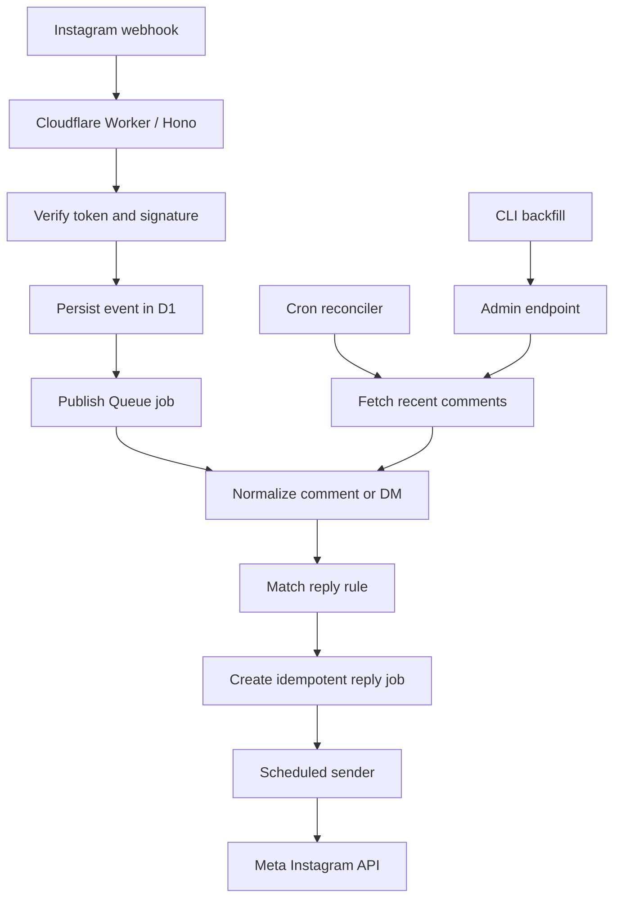

# Instagram Bot

Production-ready Instagram automation bot built on the official Meta Instagram API.

The bot receives Instagram comment and Direct Message webhooks, matches configured
keywords, and creates idempotent reply jobs for public comment replies, private
comment replies, and Direct replies. It runs on Cloudflare Workers with D1,
Queues, and Cron Triggers.

## What It Does

- Verifies and stores Instagram webhook events.
- Processes comment and Direct Message events asynchronously through a Cloudflare Queue.
- Matches comments and inbound Direct messages against `config/reply-rules.json`.
- Sends public replies to comments through `/{comment_id}/replies`.
- Sends private replies to comments through the official private reply flow.
- Sends Direct replies only after an inbound text DM from the user.
- Stores comments, Direct messages, reply jobs, attempts, Meta errors, and processing decisions in D1.
- Reconciles recent comments on a schedule in case webhook delivery misses an event.
- Provides CLI commands for status checks, backfill, manual guarded replies, and data redaction.

It does not use browser automation, cookies, mobile private APIs, or unofficial Instagram clients.

## Architecture



## Requirements

- Bun 1.3 or newer.
- A Cloudflare account with Workers, D1, Queues, and Cron Triggers enabled.
- An Instagram professional account, Business or Creator.
- A Meta app configured for Instagram API with the permissions your use case needs, typically:
  - `instagram_business_basic`
  - `instagram_business_manage_comments`
  - `instagram_business_manage_messages`
- A valid Instagram access token for the connected Instagram account.

Meta policy matters here: the bot only supports official reply flows. It cannot send cold DMs to arbitrary Instagram users, and comment private replies are constrained by Meta's private reply rules.

## Repository Layout

- `src/` - Worker app, webhook processing, reply logic, Meta client, and D1 repository.
- `scripts/` - Bun CLI helpers for local development, deploy, status, backfill, and redaction.
- `migrations/` - D1 SQL migrations applied by Wrangler.
- `config/reply-rules.json` - public example reply rules.
- `wrangler.toml` - public placeholder Wrangler config safe for open source.
- `.env.example` - local environment template.

Production-only files are intentionally ignored:

- `.env`
- `.dev.vars`
- `wrangler.production.toml`
- `config/reply-rules.production.json`
- `.wrangler/`

Do not commit real tokens, account IDs, private reply text, or production Wrangler bindings.

## Quick Start

Install dependencies:

```bash
bun install
```

Create local env files:

```bash
cp .env.example .env
cp .env.example .dev.vars
```

Fill the values in `.env` for local CLI scripts and `.dev.vars` for `wrangler dev`.

Edit reply rules:

```bash
$EDITOR config/reply-rules.json
```

Run the checks:

```bash
bun run typecheck
bun run test
bun run smoke:d1
```

Start the Worker locally:

```bash
bun run dev
```

The local admin scripts default to `http://127.0.0.1:8787` unless `ADMIN_BASE_URL` or `PUBLIC_BASE_URL` is set.

## Reply Rules

Reply rules live in JSON rather than environment variables.

Example:

```json
[
  {
    "keywords": ["demo", "хочу", "спасибо"],
    "public": "public reply",
    "private": "dm reply"
  }
]
```

Fields:

- `keywords`: a non-empty array of keywords, or a comma-separated string.
- `public`: optional text for a public comment reply.
- `private`: optional text for a private comment reply or Direct reply.
- `always`: optional boolean. When `true`, comment replies skip the existing-conversation gate.

At least one of `public` or `private` must be present. Direct replies use only `private`.

Automatic comment replies only match comments with at most one word made of letters or
digits. Emoji and punctuation do not count as words, so `хочу 🔥🙌` is accepted,
while `я хочу программу` is ignored. This restriction applies to comments only;
inbound Direct messages keep the configured phrase-matching behavior.

For production, keep private production wording in ignored `config/reply-rules.production.json`. The deploy wrapper copies it into the temporary deploy workspace as `config/reply-rules.json`, so public files are not mutated.

## Environment

Local CLI scripts read `.env` through Bun. Wrangler local development reads `.dev.vars`.

Important values:

- `ADMIN_API_KEY` - protects internal admin endpoints.
- `META_APP_SECRET` - verifies webhook signatures.
- `META_WEBHOOK_VERIFY_TOKEN` - verifies Meta webhook setup.
- `META_GRAPH_API_VERSION` - defaults to `v25.0`.
- `INSTAGRAM_ACCOUNT_ID` - connected Instagram account ID.
- `INSTAGRAM_USERNAME` - connected Instagram username, used to avoid replying to yourself.
- `INSTAGRAM_ACCESS_TOKEN` - token used for Graph API calls.
- `BOT_ENABLED` - global send switch.
- `DM_AUTOREPLY_ENABLED` - enables Direct auto-replies.
- `COMMENT_PRIVATE_REPLY_ENABLED` - enables private replies to comments.
- `COMMENT_PUBLIC_REPLY_ENABLED` - enables public replies to comments.
- `BACKFILL_REPLY_ENABLED` - allows backfill runs with `--send` to create reply jobs.

For a full pause in production, set all send flags to `false`:

```text
BOT_ENABLED=false
DM_AUTOREPLY_ENABLED=false
COMMENT_PRIVATE_REPLY_ENABLED=false
COMMENT_PUBLIC_REPLY_ENABLED=false
BACKFILL_REPLY_ENABLED=false
```

## Cloudflare Setup

Create the required Cloudflare resources:

```bash
bunx wrangler d1 create instagram_bot
bunx wrangler queues create instagram-bot-jobs
```

For a real deployment, copy the public Wrangler config and fill production bindings:

```bash
cp wrangler.toml wrangler.production.toml
```

Set the production D1 database name/id, Queue name, Worker name, `PUBLIC_BASE_URL`, feature flags, and non-secret runtime vars in `wrangler.production.toml`.

Set secrets with Wrangler:

```bash
bun run wrangler secret put ADMIN_API_KEY --config wrangler.production.toml
bun run wrangler secret put META_APP_SECRET --config wrangler.production.toml
bun run wrangler secret put META_WEBHOOK_VERIFY_TOKEN --config wrangler.production.toml
bun run wrangler secret put INSTAGRAM_ACCESS_TOKEN --config wrangler.production.toml
```

Depending on your setup, you may also keep `INSTAGRAM_ACCOUNT_ID`, `INSTAGRAM_USERNAME`, and token expiry metadata as Wrangler vars or secrets.

## Database

D1 migrations are stored in `migrations/` and applied through Wrangler.

Local schema smoke test:

```bash
bun run smoke:d1
```

Remote migration command:

```bash
bun run wrangler d1 migrations apply <database_name> --remote
```

`bun run release` prints and runs the correct remote migration command from the selected Wrangler config.

Drizzle is used as the typed runtime ORM. SQL files in `migrations/` remain the source of truth for schema changes.

## Running In Production

Production deploy is intentionally manual.

Required local ignored files:

- `wrangler.production.toml`
- `config/reply-rules.production.json`

Run:

```bash
bun run release
```

The release helper:

1. selects `wrangler.production.toml` when it exists;
2. validates `config/reply-rules.production.json` before any remote migration or deploy command;
3. runs `typecheck`, `test`, and `smoke:d1`;
4. prints the remote migration, deploy, and status commands;
5. deploys only after you type the exact confirmation `DEPLOY` in an interactive terminal.

The deploy wrapper builds from a temporary workspace. This prevents private production reply rules from being written into the tracked public `config/reply-rules.json`.

After deploy, check production status:

```bash
bun run bot:status
```

Watch logs:

```bash
bun run wrangler tail --config wrangler.production.toml --format=json
```

## Webhooks

Meta webhook configuration:

- Callback URL: `<PUBLIC_BASE_URL>/webhooks/instagram`
- Verify token: value from `META_WEBHOOK_VERIFY_TOKEN`

Routes:

- `GET /health`
- `GET /privacy`
- `GET /data-deletion`
- `GET /webhooks/instagram`
- `POST /webhooks/instagram`
- `GET /admin/status`
- `POST /admin/backfill/media/:mediaId`
- `POST /admin/reply/comment/:commentId`
- `GET /admin/data-subject`
- `POST /admin/data-subject/redact`

Admin routes require `ADMIN_API_KEY`.

## Operations

Status:

```bash
bun run bot:status
```

Backfill one media item:

```bash
bun run backfill:comments -- --media <mediaId>
```

Backfill and create eligible reply jobs:

```bash
bun run backfill:comments -- --media <mediaId> --send
```

Account-wide backfill:

```bash
bun run backfill:account-comments -- --max-media-pages 1 --max-comment-pages 25
```

Manual guarded comment reply:

```bash
bun run reply:comment -- --comment <commentId>
```

Data subject dry-run:

```bash
bun run data:redact -- --username <username>
```

Apply redaction:

```bash
bun run data:redact -- --username <username> --apply
```

## Behavior Notes

- Private replies to comments must be sent within Meta's supported window.
- The bot stores old comments found by backfill, but does not send automatic replies for comments outside the allowed window.
- Direct replies are not cold outreach; they are sent only after an inbound text DM webhook.
- The bot avoids duplicate replies with idempotency keys and persisted processing decisions.
- Existing-conversation checks can block comment auto-replies unless a rule has `always: true`.
- Failed or unavailable Meta objects are recorded and can be blocked as expected terminal states rather than retried forever.
- Cron runs every minute to send due reply jobs, clean old raw webhook payloads, requeue stale webhook events, and run scheduled maintenance.
- The reconciler scans recent media comments on a configured interval to recover missed webhook events.

## Security And Privacy

- Keep `.env`, `.dev.vars`, `wrangler.production.toml`, and `config/reply-rules.production.json` private.
- Rotate any token that was ever committed to a private repository before open-sourcing.
- Webhook POST requests are verified with `X-Hub-Signature-256`.
- Raw webhook payloads have a retention timestamp and are redacted by scheduled maintenance.
- Subject lookup data is stored separately to support operator-driven deletion/anonymization workflows.

## Useful Scripts

| Command | Purpose |
| --- | --- |
| `bun run dev` | Start local Wrangler dev server. |
| `bun run typecheck` | Run TypeScript checks. |
| `bun run test` | Run automated tests. |
| `bun run smoke:d1` | Reset local D1 app tables, apply migrations, and run a schema smoke test. |
| `bun run release` | Run preflight checks and optionally deploy production. |
| `bun run deploy` | Deploy through the safe Wrangler wrapper. |
| `bun run bot:status` | Print production or configured environment status. |
| `bun run backfill:comments` | Backfill comments for one media item. |
| `bun run backfill:account-comments` | Backfill comments across recent account media. |
| `bun run reply:comment` | Send a guarded manual reply for a stored comment. |
| `bun run data:redact` | Dry-run or apply data subject redaction. |

## References

- [Meta Instagram API Postman collection](https://www.postman.com/meta/instagram/documentation/6yqw8pt/instagram-api)
- [Cloudflare Workers TypeScript](https://developers.cloudflare.com/workers/languages/typescript/)
- [Cloudflare Workers with Hono](https://developers.cloudflare.com/workers/framework-guides/web-apps/more-web-frameworks/hono/)
- [Cloudflare D1](https://developers.cloudflare.com/d1/)
- [Cloudflare Queues](https://developers.cloudflare.com/queues/)
- [Cloudflare Cron Triggers](https://developers.cloudflare.com/workers/configuration/cron-triggers/)
